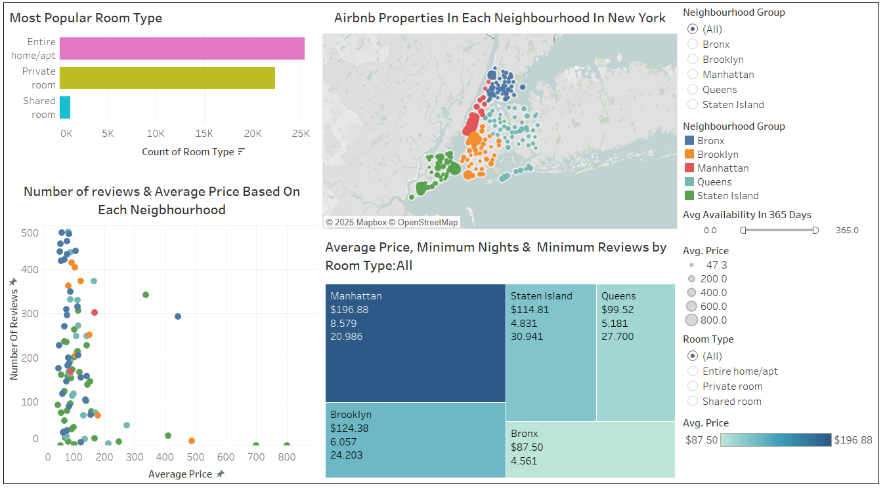

# Airbnb Listings Analysis Dashboard

## Description
This project explores Airbnb listings in New York City using a Tableau dashboard to visualize pricing trends, property popularity, and key market factors. The dashboard provides actionable insights for real estate agents and potential renters.

## Dataset
Data was sourced from Kaggle’s [New York City Airbnb Open Data](https://www.kaggle.com/datasets/dgomonov/new-york-city-airbnb-open-data). It contains listing details, prices, availability, and reviews.

## Features
- Interactive filters for neighbourhood, price range, and property type  
- Visualisations showing average prices, availability, and review scores  
- Identification of high-demand and high-priced listings

## How to View
- Download the Tableau packaged workbook (.twbx) from this repository

## Tools & Technologies
- Tableau Desktop
- Microsfot BI  

## Future Work
- Incorporate time series analysis of listing trends  
- Add predictive modelling to estimate future prices  
- Enhance interactivity with more user controls
